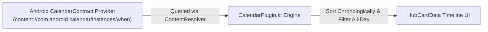

# 📅 Calendar Agenda Module

> **ID**: `plugin_calendar`  
> **Category**: Productivity & Calendar  
> **Version**: `1.0.1`  
> **Author**: RPDevs  
> **Default Installed**: No (Install via Repository)  
> **Icon**: `Calendar`

The **Calendar Agenda** module surfaces upcoming calendar appointments, meetings, and all-day milestones on your minus-one screen. It interfaces directly with Android's native `CalendarContract` ContentProvider.

---

## 🏗️ Architecture & Data Ingestion



---

## ⚙️ Configuration Reference

| Parameter Key | Label | Type | Default Value | Description |
| :--- | :--- | :--- | :--- | :--- |
| `lookahead_hours` | Lookahead Window (Hours) | Integer | `"24"` | Hours into the future to search for scheduled events. |
| `show_all_day` | Show All-Day Events | Boolean | `"true"` | Include all-day milestones at the top of the agenda card. |

---

## 🛡️ Privacy & Security Audit

- **Permissions Required**: `android.permission.READ_CALENDAR`.
- **Privacy Standard**: Zero telemetry. Event descriptions, attendees, meeting links, and calendar names are parsed strictly in local volatile memory and never transmitted externally.

---

## 📋 Sample HubCardData JSON Output

```json
{
  "id": "card_calendar",
  "pluginId": "plugin_calendar",
  "title": "Upcoming Agenda",
  "summary": "3 Events in next 24 hours",
  "iconName": "Calendar",
  "priority": 90,
  "timeline": [
    { "time": "10:00 AM", "label": "Sprint Planning Sync" },
    { "time": "02:00 PM", "label": "Architecture Review: RPDev Feed" },
    { "time": "04:30 PM", "label": "Infra Audit & Deployment Check" }
  ]
}
```
