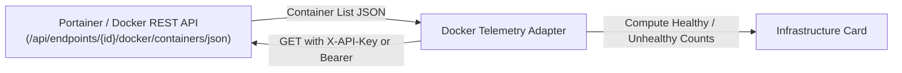

# 🐳 Docker & Fleet Health Monitor Module

> **ID**: `module_docker_telemetry`  
> **Category**: DevOps & Infrastructure  
> **Version**: `1.0.1`  
> **Author**: RPDevs  
> **Default Installed**: No (Install via Repository)  
> **Icon**: `Cpu`

The **Docker & Fleet Health Monitor** connects your minus-one feed to your self-hosted infrastructure. Monitor Docker engines via Portainer or direct Docker daemon REST sockets to display running container counts, unhealthiest services, and server resource pressure.

---

## 🏗️ Architecture & Data Ingestion



---

## ⚙️ Configuration Reference

| Parameter Key | Label | Type | Default Value | Description |
| :--- | :--- | :--- | :--- | :--- |
| `docker_endpoint` | Portainer / Docker API URL | String | `"http://192.168.1.100:9000/api/endpoints/1/docker/containers/json"` | REST endpoint returning container lists. |
| `api_key` | API Key / Token | Secret String | `""` | Portainer API Token or proxy bearer token. |

---

## 🛡️ Privacy & Security Audit

- **Permissions Required**: `android.permission.INTERNET`.
- **Infrastructure Safety**: Read-only queries. The module never executes destructive container actions (`stop`, `kill`, `rm`).

---

## 📋 Sample HubCardData JSON Output

```json
{
  "id": "module_docker_telemetry",
  "pluginId": "module_docker_telemetry",
  "title": "Fleet Health • llmadmin01",
  "summary": "14 Containers Running • 0 Unhealthy",
  "iconName": "Cpu",
  "priority": 65,
  "chips": [
    { "label": "Active: 14", "color": "green" },
    { "label": "CPU: 12%", "color": "blue" },
    { "label": "RAM: 6.4 GB", "color": "gray" }
  ]
}
```
