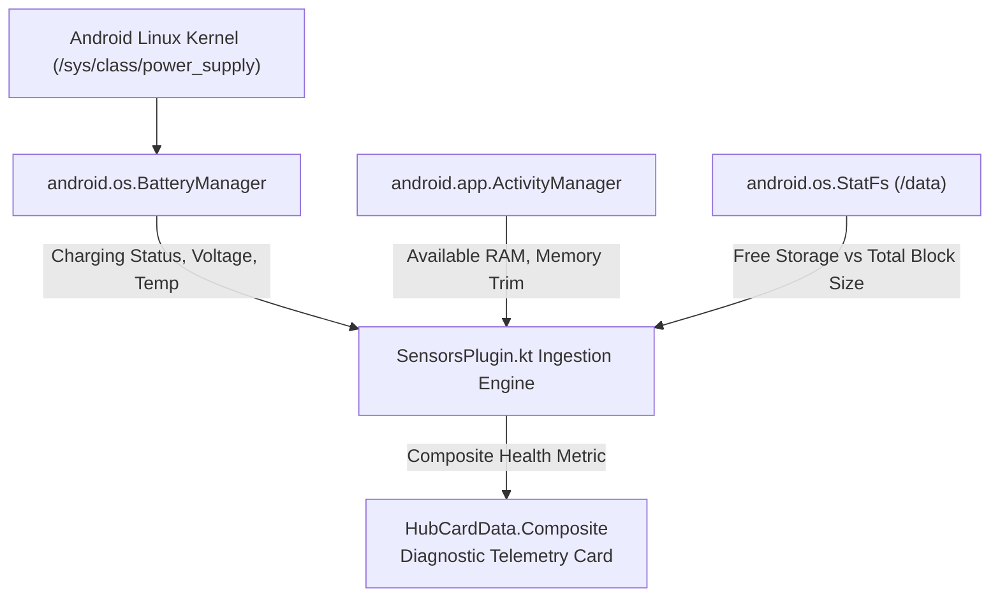

# 🔋 Hardware & Battery Telemetry Module

> **ID**: `plugin_sensors`  
> **Category**: System & Hardware  
> **Version**: `1.0.1`  
> **Author**: RPDevs  
> **Default Installed**: Yes (Core Built-In)  
> **Icon**: `BatteryCharging`

The **Hardware & Battery Telemetry** module provides low-overhead, on-device diagnostics. It continuously observes battery health, real-time charging wattage, battery temperature, storage consumption, and memory pressure directly from the Android kernel APIs.

---

## 🏗️ Architecture & Data Ingestion



### Metrics Monitored:
- **Battery Percentage & State**: Discharging, AC, USB, Wireless charging, or Fast-charge PD.
- **Charging Wattage**: Calculated dynamically via \(P = V 	imes I\) (microvolts \(	imes\) microamperes).
- **Battery Thermal**: Scaled Celsius readings from internal thermistors to prevent thermal degradation.
- **Storage Metrics**: Total storage vs available flash storage via `StatFs`.
- **RAM Pressure**: Total memory, free memory, and system low-RAM flags via `ActivityManager.MemoryInfo`.

---

## ⚙️ Configuration Reference

The Sensors module is self-configuring and requires zero manual setup parameters:

| Parameter Key | Label | Type | Default Value | Description |
| :--- | :--- | :--- | :--- | :--- |
| *None* | *None* | N/A | N/A | Autonomously samples platform hardware providers. |

---

## 🛡️ Privacy & Security Audit

- **Permissions Required**: None beyond standard Android sandbox access. Zero internet network calls are executed by this plugin.
- **Security Profile**: Completely air-gapped. Diagnostics never leave the device.

---

## 📋 Sample HubCardData JSON Output

```json
{
  "id": "card_sensors",
  "pluginId": "plugin_sensors",
  "title": "Device Diagnostics",
  "summary": "Battery 85% • Charging (18.2W)",
  "iconName": "BatteryCharging",
  "priority": 95,
  "chips": [
    { "label": "Temp 31.4°C", "color": "green" },
    { "label": "RAM 4.2 / 8.0 GB", "color": "blue" },
    { "label": "Disk 78 GB Free", "color": "gray" }
  ]
}
```
