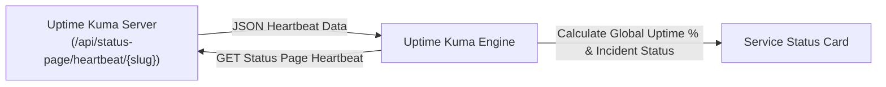

# ⏱️ Uptime Kuma Status Monitor Module

> **ID**: `module_uptime_kuma`  
> **Category**: DevOps & Infrastructure  
> **Version**: `1.0.1`  
> **Author**: RPDevs  
> **Default Installed**: No (Install via Repository)  
> **Icon**: `Activity`

The **Uptime Kuma Status Monitor** integrates with self-hosted Uptime Kuma status pages to bring critical service uptime percentages, live incident status, and HTTP latency metrics directly to your mobile desktop.

---

## 🏗️ Architecture & Data Ingestion



---

## ⚙️ Configuration Reference

| Parameter Key | Label | Type | Default Value | Description |
| :--- | :--- | :--- | :--- | :--- |
| `kuma_url` | Uptime Kuma Status Page URL | String | `"https://status.example.com/api/status-page/heartbeat/default"` | Heartbeat or metrics API endpoint from Uptime Kuma. |

---

## 🛡️ Privacy & Security Audit

- **Permissions Required**: `android.permission.INTERNET`.
- **Zero Authentication Requirement**: Compatible with public status pages without requiring administrative credentials.

---

## 📋 Sample HubCardData JSON Output

```json
{
  "id": "module_uptime_kuma",
  "pluginId": "module_uptime_kuma",
  "title": "Fleet Uptime • Kuma Monitor",
  "summary": "All Monitored Endpoints Operational (99.98%)",
  "iconName": "Activity",
  "priority": 60,
  "chips": [
    { "label": "Uptime: 99.98%", "color": "green" },
    { "label": "Avg Ping: 18ms", "color": "blue" }
  ]
}
```
