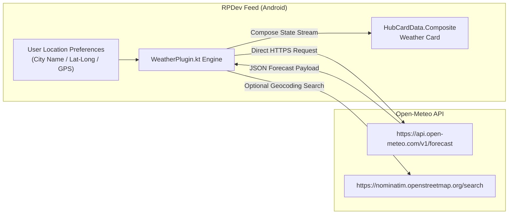

# ☀️ Privacy Weather Module

> **ID**: `plugin_weather`  
> **Category**: Weather & Environment  
> **Version**: `1.0.1`  
> **Author**: RPDevs  
> **Default Installed**: Yes (Core Built-In)  
> **Icon**: `SunDim`

The **Privacy Weather** module delivers comprehensive, real-time meteorological observations, hourly temperature curves, humidity, wind velocity, and precipitation chances directly to the **RPDev Feed** minus-one dashboard. Unlike traditional weather widgets bundled in commercial launchers, Privacy Weather connects directly to open public APIs with zero user tracking, zero advertising SDKs, and zero geolocation logging.

---

## 🏗️ Architecture & Data Ingestion



### Key Operational Characteristics:
1. **Direct Endpoint Handshake**: The Android client connects directly to Open-Meteo's open forecast endpoint. No intermediate RPDev proxy logs your IP or location queries.
2. **On-Demand Location Resolver**: Users can manually configure City/State, enter explicit GPS coordinates, or grant runtime location access.
3. **Smart Power Caching**: Forecast responses are cached locally for 30 minutes in Android Room/SharedPreferences to conserve battery and eliminate redundant radios waking up.

---

## ⚙️ Configuration Reference

| Parameter Key | Label | Type | Default Value | Description |
| :--- | :--- | :--- | :--- | :--- |
| `location_name` | Location Name | String | `"New York, NY"` | Human-readable city and region label rendered on the card header. |
| `latitude` | Latitude | Float | `"40.7128"` | Latitude coordinate of the target forecast area. |
| `longitude` | Longitude | Float | `"-74.0060"` | Longitude coordinate of the target forecast area. |
| `use_fahrenheit` | Use Fahrenheit (°F) | Boolean | `"false"` | Unit toggle: `false` for Celsius (°C), `true` for Fahrenheit (°F). |

---

## 🛡️ Privacy & Security Audit

- **Permissions Required**: `android.permission.INTERNET` (always); `android.permission.ACCESS_FINE_LOCATION` (optional, requested only if GPS auto-sync is toggled).
- **Data Retention**: 100% on-device. Coordinates and weather caches are saved exclusively to the local application sandbox.
- **Telemetry Exposure**: None. Open-Meteo does not require an API key, eliminating token tracking.

---

## 📋 Sample HubCardData JSON Output

```json
{
  "id": "card_weather",
  "pluginId": "plugin_weather",
  "title": "Weather • New York, NY",
  "summary": "21°C • Partly Cloudy",
  "iconName": "SunDim",
  "priority": 100,
  "chips": [
    { "label": "Feels like 22°C", "color": "blue" },
    { "label": "Humidity 48%", "color": "gray" },
    { "label": "Wind 12 km/h", "color": "gray" }
  ],
  "timeline": [
    { "time": "12:00", "label": "21°C • Clear" },
    { "time": "15:00", "label": "23°C • Partly Cloudy" },
    { "time": "18:00", "label": "19°C • Chance Rain" }
  ]
}
```

---

## 📱 Live Experience (DevPixel16)

The Privacy Weather card is docked at the top of the RPDev Feed overlay. On high-refresh-rate displays (120Hz), temperature curves render using hardware-accelerated Compose Canvas paths.
